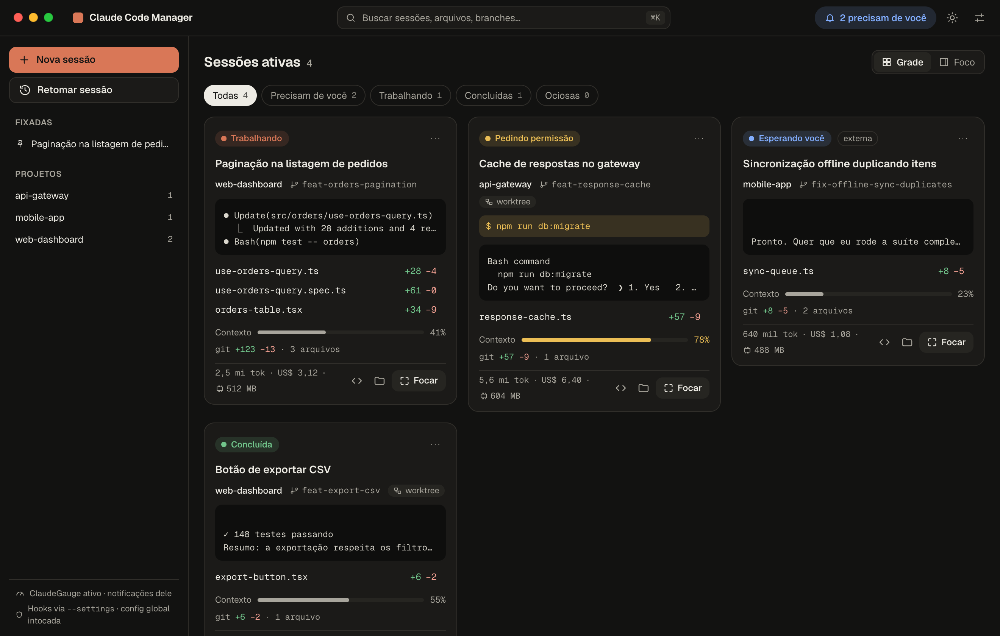
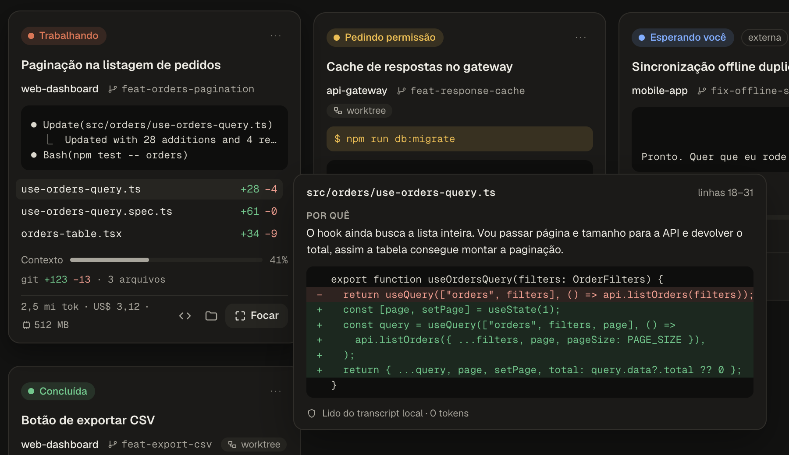
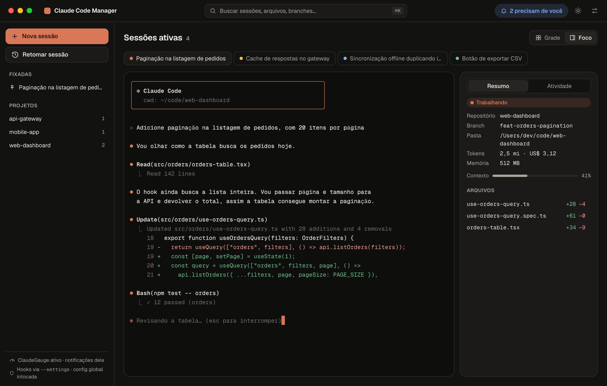
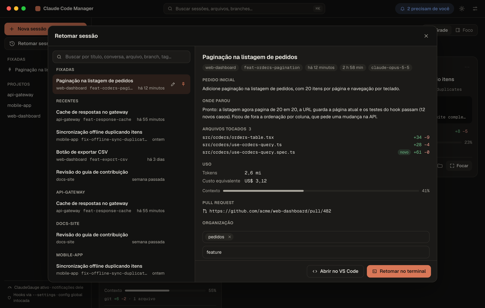
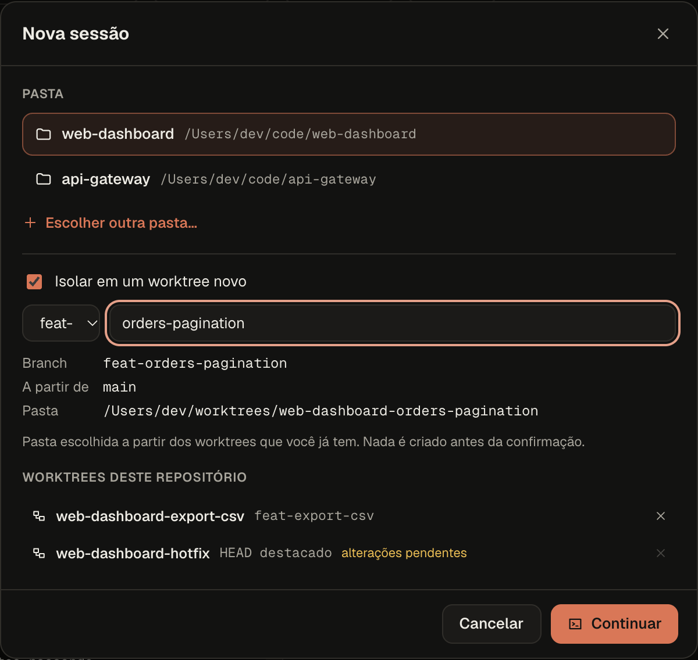
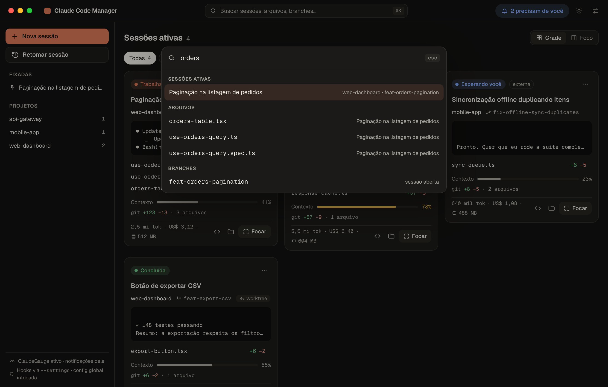
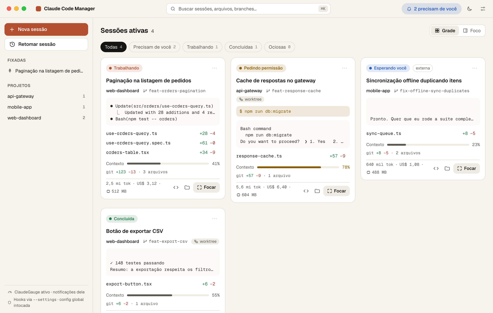

# Claude Code Manager

Um app de macOS para quem roda várias sessões do [Claude Code](https://code.claude.com) ao mesmo tempo. Ele mostra o que cada sessão está fazendo, o que ela alterou e o que está esperando de você, e deixa retomar conversas antigas sem procurar o id no terminal.

Não é uma IDE. Os terminais são reais (cada sessão é o `claude` de sempre, rodando no seu shell), e o app fica em volta deles organizando.



## Por que existe

Com quatro ou cinco sessões abertas em abas de terminal, fica difícil saber qual está pedindo permissão, qual terminou e qual ainda está trabalhando. Também é fácil perder uma conversa boa de dias atrás. E cada processo do Claude Code ocupa algumas centenas de megabytes de memória, então deixar tudo aberto "por via das dúvidas" pesa num notebook de 16 GB.

O app resolve isso lendo o que o próprio Claude Code já grava em disco, sem mudar nada na sua configuração e sem gastar um token.

## O que ele faz

**Sessões em grade.** Cada card mostra status, repositório, branch, as últimas linhas do terminal, os arquivos alterados (+/−), o quanto da janela de contexto já foi usado, tokens, custo equivalente e memória. Os filtros separam as que precisam de você das que estão trabalhando ou já terminaram, e os cards podem ser reordenados arrastando.

**Por que mudou isso?** Ao passar o mouse (ou focar com o teclado) num arquivo, aparece o diff daquela edição e o texto que o assistente escreveu logo antes de fazê-la. Tudo é lido do transcript local.



**Modo foco.** O terminal da sessão em tamanho grande, com abas para alternar e um painel com o resumo e a linha do tempo da atividade.



**Retomar sessões.** O histórico inteiro, com busca local (título, conversa, arquivo, branch, tag), agrupado em fixadas, recentes e por projeto. Cada sessão tem um resumo montado sem LLM: o pedido inicial, onde parou, os arquivos tocados, a duração e o custo. Dá para renomear, fixar, pôr tags e categoria, e retomar no terminal com um clique.



**Worktrees.** Uma sessão nova pode nascer num worktree isolado, com branch própria. A pasta segue o padrão dos worktrees que você já tem. Antes de criar, o app mostra o comando exato e pede confirmação.



**Busca rápida (⌘K).** Sessões abertas, histórico, arquivos, branches e ações, num lugar só.



**Status de verdade.** Nas sessões abertas pelo app, o status vem dos hooks do Claude Code: trabalhando, pedindo permissão (com o comando pedido), esperando você, concluída ou ociosa. Sessões abertas em outros terminais aparecem também, marcadas como externas.

**Barra de menus.** Um ícone mostra quantas sessões precisam de você, com uma lista para pular direto para qualquer uma. Fechar a janela só a esconde; as sessões continuam rodando.

**Tema claro e escuro.**



## O que ele não faz

- Não edita código, não tem extensões e não substitui o seu editor (o botão abre o VS Code).
- Não mostra cota de uso nem gastos agregados. Para isso existe o [ClaudeGauge](https://github.com/PedroHenriqueGazola/ClaudeGauge), e os dois convivem bem.
- Não sincroniza nada com nuvem.

## Garantias

- **`~/.claude/` e `~/.claude.json` são somente leitura.** Toda escrita do app passa por uma checagem que recusa esses caminhos, e um teste de integração exercita o núcleo do app (banco, indexação, hooks e registro de sessões) com `~/.claude` sem permissão de escrita, conferindo que nenhum arquivo ali muda.
- **Sua configuração do Claude Code não muda.** Os hooks do app entram só nas sessões que ele abre, pela flag `claude --settings`, e se somam aos seus. O arquivo de settings não tem segredo: o token de cada sessão vai por variável de ambiente.
- **Zero tokens.** O app nunca chama modelo nenhum nem a API da Anthropic, e não lê o token de login.
- **Git só com confirmação.** As únicas operações que escrevem são criar e remover worktree. A remoção recusa worktrees com alterações pendentes. Nada de `checkout`, `reset`, `stash` ou `--force`.
- **Dados locais.** Nomes, tags, ordem dos cards, índice de busca e configurações ficam em `~/Library/Application Support/ClaudeCodeManager/`.

## Instalação

Requisitos: macOS 14 ou superior em Apple Silicon, Node 20.19+, [Rust](https://rustup.rs) estável e as Command Line Tools do Xcode.

```bash
git clone https://github.com/Pedro-B-Siqueira/claude-code-manager.git
cd claude-code-manager
npm install
npm run generate
```

O `.app` e o `.dmg` ficam em `src-tauri/target/release/bundle/`. O build não é assinado; na primeira vez, abra com botão direito → **Abrir**.

Se o Rust foi instalado com `rustup --no-modify-path`, não tem problema: os scripts já incluem `~/.cargo/bin`.

## Uso

| Atalho | Ação |
|---|---|
| ⌘K | Busca rápida |
| ⌘N | Nova sessão |
| ⌘1…9 | Ir para a sessão N |
| ⌘, | Configurações |
| ⌘Q | Sair (pede confirmação se alguma sessão estiver trabalhando) |

Sem login no Claude Code, o histórico e a busca funcionam normalmente. Ao abrir uma sessão, o próprio Claude Code pede o login no terminal embutido, como faria em qualquer terminal.

Nas configurações dá para trocar o tema, a pasta e os prefixos de branch dos worktrees, o scrollback, as notificações, a hibernação e o caminho do `claude`.

## Como funciona

- **Histórico.** Os transcripts em `~/.claude/projects` são lidos de forma incremental (só o que foi acrescentado) e indexados num SQLite com busca FTS5. FSEvents avisa quando algo muda, sem polling.
- **Sessões vivas.** As do app rodam num PTY pelo seu shell de login, então herdam o mesmo PATH e ambiente do seu terminal. As externas vêm do registro de sessões que o Claude Code mantém em `~/.claude/sessions`.
- **Status.** Um servidor HTTP local, só em `127.0.0.1`, recebe os hooks das sessões do app. Cada sessão tem um token próprio, e o servidor só observa: nunca responde uma decisão no lugar do Claude Code.
- **Custo equivalente.** Calculado a partir do `usage` de cada resposta, contada uma vez só (o transcript repete a mesma resposta em várias linhas), com os preços oficiais de cada modelo.

Os detalhes estão em [`docs/ARCHITECTURE.md`](docs/ARCHITECTURE.md).

## Memória

Medido num Mac Apple Silicon com 16 GB e macOS 26.6, usando `scripts/measure-memory.sh`:

| Cenário | App | WebKit | Terminais | Total |
|---|---|---|---|---|
| Release, 0 sessões | 98 MB | 112 MB | — | **210 MB** |
| Dev, 0 sessões | 131 MB | 163 MB | — | 294 MB |
| Dev, 6 sessões (`fake-claude`) | 133 MB | 183 MB | 57 MB | 373 MB |

O que o app gasta por sessão é pouco: cerca de 0,3 MB no processo principal, uns 3 MB na interface e uns 8 MB para o shell de login. O peso de verdade é o próprio `claude`, que ocupou de 500 a 610 MB por processo na mesma máquina.

Por isso a hibernação vem ligada. Depois de 30 minutos ociosa (configurável), uma sessão aberta pelo app tem o processo encerrado e volta com `claude --resume` quando você a abre. Sessões trabalhando, pedindo permissão ou esperando você nunca hibernam. Além disso, só a sessão em foco tem um terminal desenhado (a grade usa uma prévia em texto), e as prévias param quando a janela está escondida.

## Desenvolvimento

| Comando | O que faz |
|---|---|
| `npm run dev` | App em modo de desenvolvimento |
| `npm run generate` | Build de produção (`.app` e `.dmg`) |
| `npm test` | Testes Rust, checagem de tipos e testes do frontend |
| `scripts/measure-memory.sh` | Mede a memória do app aberto |

Os testes nunca rodam o `claude` de verdade. Eles usam o `fake-claude` (`src-tauri/crates/fake-claude`), um binário que imita a saída no terminal e chama os hooks declarados no `--settings`, apontado pela variável `CCM_CLAUDE_BIN`. Para ver a cadeia inteira funcionando em dev:

```bash
CCM_E2E=pty-smoke CCM_E2E_CWD=/tmp CCM_CLAUDE_BIN=$PWD/src-tauri/target/debug/fake-claude npm run dev
```

Builds de release ignoram essas variáveis.

## Versões validadas

| | Versão |
|---|---|
| Claude Code | 2.1.295 |
| Tauri | 2.11 |
| Svelte | 5.57 |
| Rust | 1.99 |

O formato dos transcripts e o registro de sessões não são API oficial do Claude Code e podem mudar entre versões. Cada formato fica isolado em um módulo próprio, com testes, e o app mostra "indisponível" em vez de quebrar.

## Créditos

- [**ClaudeGauge**](https://github.com/PedroHenriqueGazola/ClaudeGauge), de Pedro Henrique Gazola (MIT): referência para o cálculo de custo equivalente e a detecção de sessões vivas. A lógica foi reescrita em Rust, com duas diferenças: cada resposta é contada uma vez só e os preços são os oficiais dos modelos atuais.
- [**Geist** e **Geist Mono**](https://vercel.com/font), da Vercel (SIL Open Font License 1.1), embutidas no app.
- Feito com [Tauri](https://tauri.app), [Svelte](https://svelte.dev), [xterm.js](https://xtermjs.org) e [svelte-dnd-action](https://github.com/isaacHagoel/svelte-dnd-action).
